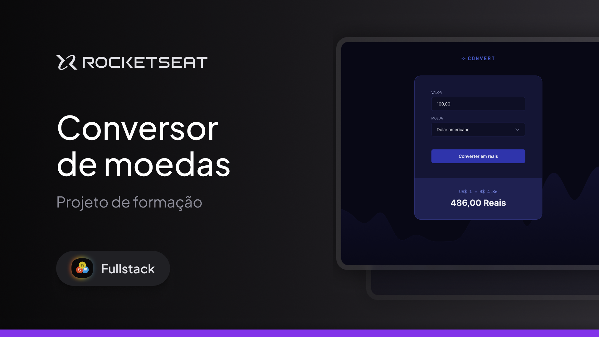

<h1 align="center">
  
</h1>

## Projeto 💻

O Convert é uma aplicação web de conversão de moedas para o real.

Esse é um dos desafios práticos da formação FullStack, um dos conteúdos disponíveis para alunos da Rocketseat.

## Funcionalidades

- Ele converte os valores da moeda do dolár americano, euro e libra esterilina, para o real brasileiro

## Tecnologias

Esse projeto foi desenvolvido com as seguintes tecnologias

- HTML
- CSS
- JavaScript

---

## Acessar o Projeto

Para acessar o projeto, basta clicar neste link abaixo:  
<a href="https://pduartesilva2005.github.io/convert/" target="_blank">Ver o projeto online!</a>

Criado por Pedro Duarte
